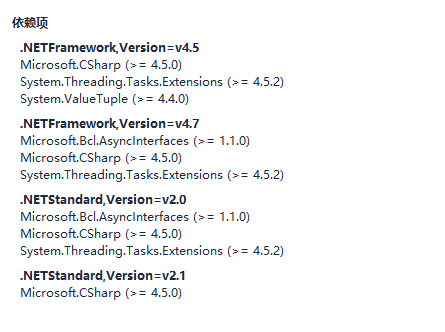

# Csv文件操作  CsvHelper使用介绍

[官方地址](https://joshclose.github.io/CsvHelper/)

## 在NuGet下载 CsvHelper

- 使用CsvHelp需要确保项目Net版本高于4.5

- 在官网有大量的使用例子

- **在读取过程中如果报错误 “Bad data·····”可以使用记事本打开.csv文件查看。**在做实验的时候有发现wps创建csv文件，在wps下产看是没有问题，但是在记事本下打开是乱码的情况。
